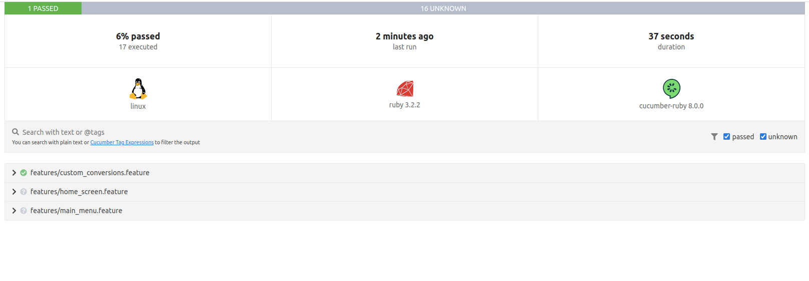

# ruby-cucumber-appium-test
Projeto utilizando Ruby com cucumber e appium para mobile

### Anotações passo a passo
- Criar devide no Android Studio
- Criar um projeto no RubyMine
- Criar pasta features
  - Aqui seram criados os testes .features com o passo a passo usando o cucumber com a escrita em Gherkin
- Criar sub paste step_definitions
  - Aqui seram criados os steps em ruby de cada teste e seus cenários criados no arquivo .features
    - A cada Scenario criado rodar o "cucumber" para copiar o step a ser adicionando no arquivo em ruby (.rb)
- Criar pasta support
  - Aqui seram criados as classes:
    - hooks.rb (Aqui vai ter o Before/After do driver que sera setado em cada teste)
    - env.rb (Aqui será configurado os capabilities do app para ser utilizado no driver)
- Elements inspector
  - Abrir Appium Server
  - Selecionar lupa
  - Criar capabilities
  ```
  {
  "appium:deviceName": "Pixel 6 Pro API 33",
  "appium:udid": "emulator-5554",
  "platformName": "Android",
  "appium:platformVersion": "13.0",
  "appium:app": "/home/tqi_dmachado/workspace/ruby-cucumber-appium-test/features/support/PreciseUnitConversion.apk"
  }
  ```
  
### Pré-requisitos
Certifique-se de ter o Ruby, o bundler instalados em seu sistema. Além disso, configure o ambiente de desenvolvimento para executar testes em um dispositivo móvel ou emulador.
- Ruby (2.4.0 ou superior)
- Bundler (1.15.0 ou superior)
- Android Studio
- Java Development Kit (JDK) 8 ou superior

Como criar um novo projeto Gradle(Isso criará uma estrutura de diretórios básica para o seu projeto):
> gradle init --type=ruby-library 

Instale as dependências do projeto
> bundle install


### Estrutura de diretórios
````
projeto_login_mobile
├── Gemfile 
├── Gemfile.lock
├── features 
│   ├── login.feature  
│   ├── step_definitions 
│   │   └── login_steps.rb
│   └── support
│       ├── app.rb
│       └── env.rb 
│       └── app.apk 
└── cucumber.yml
````
- O diretório **features** contém os arquivos de feature em linguagem Gherkin para descrever os cenários de teste.
- O diretório **step_definitions** contém os arquivos de implementação dos passos dos cenários de teste.
- O arquivo **Gemfile** especifica as dependências do projeto.
- O arquivo **env.rb** configura o ambiente de teste, incluindo as configurações do Appium.
- O arquivo **env.rb** configura o ambiente de teste, incluindo as configurações do Appium.
- O arquivo **hooks.rb** configurao que serão executados antes e depois de cada cenário de teste, permitindo que você adicione código de inicialização e finalização personalizado, bem como capturas de tela automatizadas em caso de falha nos testes.
- O arquivo **cucumber.yml** configurao de tags de testes para utiliza-las como parêmetro na execução.

### Executando os testes
1- Certifique-se de que o dispositivo móvel ou emulador esteja conectado e configurado corretamente.

2- No terminal, na raiz do projeto, execute o seguinte comando para iniciar a execução dos testes:

Comando para validar/gerar os steps
> cucumber 

Comando para verificar quais steps estão faltando
> cucumber --dry-run

Validar teste com parâmetros
> cucumber -t @default @wip

Comando quando possui tags customaizadas no arquivo **cucumber.yml**:
> cucumber -p custom --dry-run

Verificar o gem instalado na máquina (appium_lib e o cucumber)
> gem list

Listar devices local
> adb devices

Obter/imprimir o objeto inteiro da tela do app
> puts (get_source)

Utilizar biblioteca **pry** para fins de depuração no Cucumber,
> require "pry"

> sudo apt-get install pry

> bundle install

> binding.pry # Adicione esse ponto de interrupção

Comando Jenkins Local
```
1- http://localhost:8080/`
2- sudo cat /var/lib/jenkins/secrets/initialAdminPassword
3- Colar chave avançar
4- Selecionar opção Instalar plugins sugeridos
5- Realizar login local (criar user e pass)
6- Usar instancia padrão sugerida
7- Comandos:
  sudo service jenkins start
  sudo service jenkins stop
  sudo service jenkins restart
  sudo service jenkins status
  sudo find / -name jenkins.war # Localizar dir da instalação
  sudo cat /var/lib/jenkins/secrets/initialAdminPassword # reiniciar senha Admin
```


### Trabalando com elementos de Array no terminal
```
irb
3.0.0 :001 > ["Diego", "Theo"]
 => ["Diego", "Theo"] 
3.0.0 :002 > ar = ["Diego", "Theo"]
 => ["Diego", "Theo"] 
3.0.0 :003 > ar
 => ["Diego", "Theo"] 
3.0.0 :004 > ar[1]
 => "Theo" 
3.0.0 :005 > ar = ["Diego", "Theo", "Daniela"]
 => ["Diego", "Theo", "Daniela"] 
3.0.0 :006 > ar[2]
 => "Daniela" 
3.0.0 :007 > 
```

### Report
Para gerar report nos testes passar os seguintes parâmetros no teste
> --format html --out report.html --format pretty


*report sera gerado na pasta raiz do projeto.*

### Links de apoio

* **Instalações Linux:**
  * [Cucumber Ruby](https://github.com/cucumber/cucumber-ruby)
  * [Setup ambiente Ubuntu 20.04 ](https://gorails.com/setup/ubuntu/20.04)
  * [Instação cucumber Ubuntu 20.04](https://installati.one/install-cucumber-ubuntu-20-04/)
    * [Outros comando instação cucumber linux](https://www.thelinuxfaq.com/ubuntu/ubuntu-16-04-lts-xenial-xerus/cucumber?type=uninstall)
  * [Instação ruby Ubuntu](https://phoenixnap.com/kb/install-ruby-ubuntu)
    * [Outros comandos instação ruby linix](https://www.thelinuxfaq.com/ubuntu/ubuntu-17-04-zesty-zapus/ruby-full?type=uninstall)
  * [Soluções de problema de gem](https://bundler.io/blog/2019/05/14/solutions-for-cant-find-gem-bundler-with-executable-bundle.html)
* **Dependencias:**
  * [Dep: pry](https://rubygems.org/gems/pry/versions/0.14.1)
  * [Dep: eventmachine](https://rubygems.org/gems/eventmachine/versions/1.2.7)
* **Jenkins:**
  * [Jenkins](https://www.jenkins.io/download/)
  * [Install Linux](https://pkg.jenkins.io/debian/)


